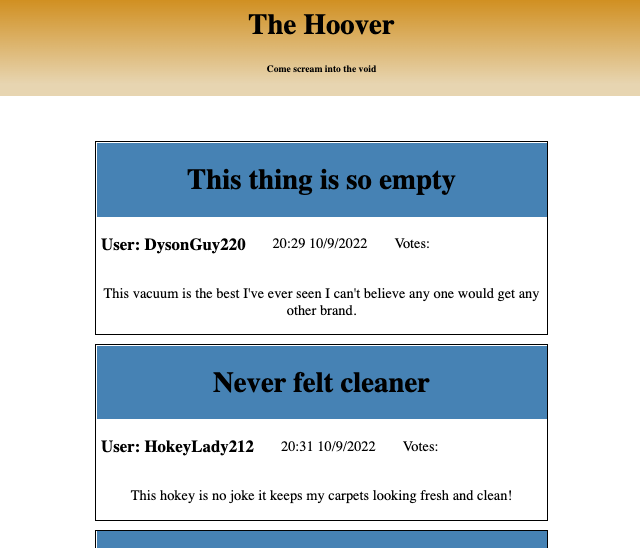

# Hoover 

## A Vacuum focused message board.

## By Liam Campbell and Ben Goodrow



## Technologies Used

* React.js
* Html
* Node
* Javascript
* Redux

## React Element Maps


## Description

_This site allows a user to create a post. The post will get a time stamp. Users can vote up or down for the posts._

## Set up/Installation requirements

* Clone [this](https://github.com/lcmpbll/The-Hoover) respository to your desktop.
* Navigate to the top level of the repository.
* `$npm install`
* `$npm run start`

 
### Available Scripts
_In the project directory you can run:_

#### ```$npm start```
_Runs the app in the development mode._
_Open http://localhost:3000 to view in your browser._

_The page will reload when you make changes_
_You will also see any errors in the console._

#### ```$npm test```

_Lanches the test runner in the interactive watch mode._

#### ```$npm run build```

_Builds the app for production to the build folder._
_It correctly bundles React in production mode and optimizes the build for best performance._

_The build is minified and the file names include hashes._

### Known Bugs

* None

## License

_Feel free to reach out via [Github](github.com.lcmpbll) to provide feedback on this project or to view my other projects._

[Copyright](LICENSE) (c) _10-09-2022_ _Liam Campbell and Ben Goodrow_